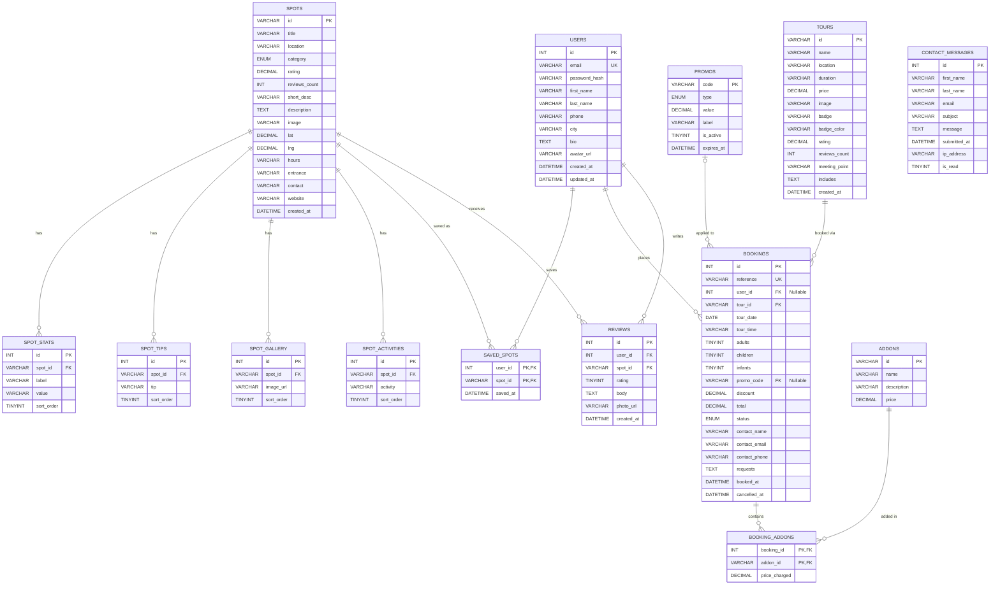

# 12 — Project Documentation (Submission Deliverable)

> **Phase 12 of 12** · Owner: _Documentation lead + entire group_ · Depends on: completed implementation

This file is the **formal documentation deliverable** required by the PUP rubric. It contains all 13 sections the rubric mandates. Most content is pre-written from the project's actual implementation; you only need to fill in `[PLACEHOLDERS]` and convert the diagrams into visual form.

## How to use this file

1. Read top to bottom. Replace every `[PLACEHOLDER]` with your group's actual values.
2. The Use Case Diagram, ERD, and Interface Design sections contain textual specifications. Draw them in **draw.io**, **Lucidchart**, or **Figma**, then embed the resulting images (export as PNG).
3. Capture the screenshots called for in the Interface Design and Testing Results sections (XAMPP must be running, the app seeded, and a demo account logged in).
4. Export the finished document as PDF *or* convert to Word *or* keep as Markdown — the rubric accepts any of these three.
5. Submit alongside the source-code zip per the Submission Guidelines on page 4 of the rubric.

---

# Tara Pangasinan — Project Documentation

---

## 1. Title Page

> _Center this content on the first page when exporting._

**Republic of the Philippines**
**POLYTECHNIC UNIVERSITY OF THE PHILIPPINES**
**College of Computer and Information Sciences**

---

# Tara Pangasinan
## A Web Application for Promoting Tourism in Pangasinan Province

A Final Project Submitted to the Faculty of the
College of Computer and Information Sciences
in Partial Fulfillment of the Requirements for the Course
**[COMP-20163 — Web Development]**

---

**Submitted by:**
**Group 5**

| Name | Role |
|---|---|
| Bacolor, James Clark | Frontend Lead & UI/UX |
| Caole, Stephanie     | UI/UX Designer |
| Guarin, Pauline      | Documentation Lead |
| Soriano, Shouma King | Backend Lead |
| Lituco, Jessica Jhoanne | UI/UX Designer |

**Submitted to:** [PROFESSOR'S NAME]
**Date:** June 18, 2026
**Section:** [SECTION CODE]

---

## 2. Introduction

Pangasinan, located in the western part of Luzon, is among the most visited provinces in the Philippines. It is home to the world-famous Hundred Islands National Park, the historical Cape Bolinao Lighthouse, the pristine Patar White Sand Beach, and the deeply revered Our Lady of Manaoag Shrine. Despite its rich natural and cultural assets, tourism information about the province remains fragmented across social-media pages, blogs, and government microsites that are difficult to compare, often outdated, and rarely allow direct booking.

**Tara Pangasinan** is a database-driven web application that consolidates this information into a single, mobile-friendly platform. The system enables travelers to (1) discover tourist destinations across the province with detailed location, rating, activity, and gallery information; (2) save spots they wish to visit; (3) read and contribute reviews based on real user experiences; (4) book tours directly through a multi-step wizard; and (5) communicate with the operations team via a built-in contact form.

The system was built using the technology stack covered in the Web Development course — HTML5, CSS3, JavaScript (ES5/ES6), PHP 8 with PDO, MySQL via XAMPP, AJAX via the Fetch API, and JSON as the data interchange format. No external front-end frameworks were used; every line of code maps to a topic discussed in class.

The project demonstrates the integration of front-end presentation, client-side and server-side validation, RESTful-style API design, secure authentication using `password_hash`, relational database modeling with foreign-key constraints, and full CRUD operations on multiple resources.

---

## 3. Objectives

### 3.1 General Objective
To design and develop a responsive, secure, database-driven web application that promotes tourism in Pangasinan Province by providing accurate destination information and enabling end-to-end tour booking.

### 3.2 Specific Objectives

By the end of the project, the system shall:

1. Present an **accessible directory of eight curated tourist destinations** in Pangasinan, each enriched with location, category, rating, gallery images, activities, visitor tips, and contextual statistics.
2. Provide **secure user registration and login** using `password_hash` (bcrypt) and PHP session management.
3. Allow registered users to **save destinations** for later reference, with their saved list synchronized between devices through the database.
4. Implement a **complete CRUD lifecycle for visitor reviews** — Create (post a review), Read (view paginated reviews), Update (edit one's own review), Delete (remove one's own review) — with the spot's aggregate rating maintained transactionally.
5. Provide a **multi-step booking wizard** for six tour packages with optional add-ons, server-validated promo codes, and server-side total recomputation to prevent client-side price tampering.
6. Allow users to **view and cancel their bookings** from a personal booking history accessible after login.
7. Accept **contact-form submissions** with honeypot anti-spam protection and IP-based rate limiting (five submissions per hour).
8. Enable users to **edit their profile** (name, email, phone, city, biography) and **change their password** with current-password verification.
9. Enforce **both client-side and server-side input validation** on every form.
10. Maintain **data integrity** through foreign-key constraints, UNIQUE indexes, ENUM-restricted enumerations, CHECK constraints, and transactional aggregates.

---

## 4. Scope and Limitations

### 4.1 Scope

The system covers the following functional areas:

- **Public browsing.** Anyone (including guests) may explore the spot catalog, view spot details, read reviews, and view tour offerings without registration.
- **User account management.** Users may register with email + password, log in, log out, edit their profile, and change their password.
- **Destination catalog.** Eight tourist spots are seeded into the database, each with normalized records for activities, gallery images, visitor tips, and quick statistics.
- **Reviews.** Logged-in users may post one review per spot, edit it, or delete it. Aggregate ratings recompute automatically.
- **Saved spots.** Logged-in users may favorite spots; the list persists in the database.
- **Bookings.** Both guests and registered users may book tours. Registered users see their booking history and may cancel upcoming bookings.
- **Promo codes.** Three promo codes (TARA10, PANGASINAN, FIRSTTIME) are validated server-side.
- **Contact form.** Visitors may submit inquiries; entries persist in the database with rate limiting.
- **Map view.** Spots are plotted on a Leaflet-powered map with their geographic coordinates.

### 4.2 Limitations

The following are explicitly **outside** the scope of this project:

- **No payment processing.** Bookings record the desired tour, date, and add-ons but do not collect or charge for payment. Real-world deployment would integrate a gateway such as PayMongo or Stripe.
- **No automated email delivery.** Confirmation messages are displayed on screen only. Real-world deployment would integrate SMTP via PHPMailer or a transactional email provider.
- **No native mobile app.** The application is a responsive web app, accessed through a browser. There is no iOS or Android binary.
- **No multi-language support.** The interface is English-only; localization to Filipino, Pangasinense, or Ilocano was not included.
- **No public admin panel.** Administrators read submissions and manage records directly through phpMyAdmin during this academic cycle. A formal admin UI is left as future work.
- **No third-party authentication.** Sign-in with Google, Facebook, or Apple was excluded to keep the authentication stack within course material.
- **No password reset flow.** Implementing this would require an email-delivery integration, which is excluded above.
- **Single deployment target.** The application is deployed on the local XAMPP stack of the developers' machines and is not yet hosted on a public web server.

---

## 5. System Features

The system is organized into eight functional modules corresponding to user-visible capability areas. Each module is designed to provide a seamless and secure experience for both guests and authenticated users.

### 5.1 Authentication Module
The Authentication Module provides a secure foundation for user identity management. When new users register, their credentials are protected using industry-standard bcrypt hashing via PHP's `password_hash()` function, ensuring that plaintext passwords are never stored in the database. During the login process, the system employs `password_verify()` to perform a constant-time comparison, effectively mitigating timing attacks. Once authenticated, user sessions are securely managed through PHP's native `$_SESSION` mechanism. Furthermore, the module provides complete session lifecycle management, including robust logout functionality that fully destroys the active session, as well as a live session-checking API endpoint to maintain synchronized state between the client interface and the server.

### 5.2 Destination Catalog Module
The Destination Catalog acts as the primary discovery interface for the application. It presents a comprehensive listing of all available tourist spots, equipped with robust search and sorting capabilities. Users can easily organize destinations by popularity, user rating, or name, and apply category filters to narrow down their options. Selecting a destination reveals a detailed spot page that immerses the user with a descriptive overview, a photo gallery, available activities, visitor tips, and contextual statistics. To aid in practical planning, the module also displays operating hours, contact information, and integrates an interactive map that pinpoints the geographic coordinates of each destination.

### 5.3 Reviews Module
Demonstrating a complete CRUD (Create, Read, Update, Delete) lifecycle, the Reviews Module empowers users to share their authentic experiences. Logged-in users are permitted to create a review consisting of a star rating and a textual body ranging from 10 to 1,000 characters. To maintain the integrity of the rating system, a unique constraint ensures that each user can only submit one review per spot. The public can seamlessly read these reviews, which are presented in a paginated format prioritizing the newest entries. If a user wishes to modify their feedback, they can update their own review through an intuitive inline editing interface. Should they choose to remove their feedback, a soft confirmation prompt precedes the hard deletion. Crucially, any mutating operation—whether creating, updating, or deleting a review—triggers a transactional recalculation of the spot's aggregate rating and review count, ensuring the catalog always reflects accurate data.

### 5.4 Saved Spots Module
The Saved Spots Module introduces a personalized curation feature for travelers. By interacting with a prominent heart icon on any spot card, users can toggle a destination into their favorites. For authenticated users, this action persistently saves the selection to the relational database, ensuring their curated list remains accessible across different devices and sessions. The dedicated "Saved" interface presents a consolidated view of these favorited spots. To ensure an inclusive user experience, guest users are also accommodated; their saved spots are temporarily retained in the browser's `localStorage` as a fallback mechanism.

### 5.5 Bookings Module
The Bookings Module facilitates end-to-end tour reservations through a streamlined, six-step booking wizard. Customers begin by selecting a specific tour, followed by their preferred date and one of three predefined time slots (Sunrise at 6 AM, Morning at 8 AM, or Afternoon at 1 PM). The flow continues with specifying the guest count and optionally attaching add-ons such as snorkel gear, a private guide, or transport services. During the review stage, users can apply server-validated promotional codes that automatically calculate percentage or fixed discounts. To completely prevent client-side price manipulation, the system rigorously recomputes all totals on the server before finalizing the transaction. The module is accessible to guests via a nullable user reference, while registered users gain the added benefit of a dedicated booking history portal where they can monitor and seamlessly cancel upcoming reservations.

### 5.6 Profile Module
The Profile Module serves as a centralized hub for account personalization and management. Users can easily update their personal details, including their first name, last name, email address, phone number, city, and a short biography. To prevent account conflicts, the system performs a strict email uniqueness check and returns a standard HTTP 409 Conflict response if a duplicate is detected. Additionally, the module facilitates secure password changes through an inline form that strictly requires the verification of the user's current password before applying any updates.

### 5.7 Contact Module
The Contact Module provides a structured communication channel between site visitors and the administrative team. Users can categorize their inquiries using a predefined subject dropdown, encompassing Tour Inquiries, Customer Support, Partnerships, and other general messages. To combat automated spam without degrading the user experience, the form is fortified with an invisible honeypot field that traps naive bots. Furthermore, the system enforces a strict IP-based rate limit, restricting submissions to five messages per hour per IP address. All valid submissions are safely persisted to the database for subsequent administrative review.

### 5.8 Map Module
The Map Module provides a spatial context to the application's catalog. Utilizing the Leaflet.js client-side library, it renders a performant OpenStreetMap base layer without relying on proprietary mapping APIs. Every tourist spot from the database is accurately plotted onto this map using precisely stored latitude and longitude coordinates. When a user interacts with a map marker, a dynamic popup reveals a thumbnail image, the destination's name, and a direct navigational link to its comprehensive details page, seamlessly bridging the geographic overview with deep content exploration.

---


## 6. Use Case Diagram

> **Drawing instructions.** The diagram below uses textual notation. Replicate it in draw.io or Lucidchart using the standard UML use-case symbols (stick figures for actors, ovals for use cases, lines for associations, dashed arrows with `<<include>>` labels for inclusions). Export as PNG and insert here.

### 6.1 Actors

- **Guest** — an unauthenticated visitor browsing the site
- **Registered User** — an authenticated user with a database record in `users`
- **System Administrator** — staff who read database records directly via phpMyAdmin

### 6.2 Use Cases by Actor

**Guest** can:
- View Destination Catalog
- Search and Filter Destinations
- View Destination Details
- View Reviews
- View Tour Catalog
- Submit Contact Inquiry
- Book Tour (as guest)
- Register Account
- Log In

**Registered User** can (inherits everything Guest can do, plus):
- Save Destination to Favorites
- Unsave Destination
- Post Review *(<<include>> Validate Review Input)*
- Edit Own Review
- Delete Own Review
- View Booking History
- Cancel Upcoming Booking
- Edit Profile *(<<include>> Verify Email Uniqueness)*
- Change Password *(<<include>> Verify Current Password)*
- Log Out

**System Administrator** can:
- Read Contact Messages
- Review Bookings
- Moderate Reviews
- Manage Tours and Promo Codes

### 6.3 Textual Diagram (for reference)

```
                ┌───────────────────────────────────────────┐
                │              Tara Pangasinan              │
                │                                           │
                │  (View Catalog)        (Search/Filter)    │
   ┌──────┐ ────│  (View Details)        (View Reviews)     │
   │Guest │     │  (View Tours)          (Book Tour)        │
   └──────┘ ────│  (Submit Contact)      (Register)         │
                │  (Log In)                                 │
                │                                           │
                │  ─────── Registered User adds: ────────   │
                │                                           │
   ┌──────┐ ────│  (Save Spot)           (Post Review)      │
   │ User │     │  (Edit Review)         (Delete Review)    │
   └──────┘ ────│  (View My Bookings)    (Cancel Booking)   │
                │  (Edit Profile)        (Change Password)  │
                │  (Log Out)                                │
                │                                           │
                │  ─────── Admin (via phpMyAdmin): ──────   │
                │                                           │
   ┌──────┐ ────│  (Read Messages)       (Review Bookings)  │
   │Admin │     │  (Moderate Reviews)    (Manage Tours)     │
   └──────┘     │                                           │
                └───────────────────────────────────────────┘
```

---

## 7. Entity Relationship Diagram (ERD)

The following Entity Relationship Diagram (ERD) visualizes the structural schema of the database. It outlines the core entities, their primary attributes, and the intricate network of relationships that bind them together.

### 7.1 Visual ERD



### 7.2 Relationship Overview
The schema operates on 14 distinct tables that are intricately connected via 13 physical foreign key relationships. The design relies heavily on one-to-many structures (e.g., one user creating many reviews) and effectively resolves complex many-to-many relationships (e.g., users saving spots, bookings utilizing add-ons) through dedicated junction tables. This robust interconnectedness ensures data integrity and supports the dynamic nature of the application.

---

|---|---|
| `users` | `id` | Stores `password_hash` only, never plaintext. |
| `spots` | `id` (slug VARCHAR) | Catalog of destinations. |
| `spot_activities` | `id` | Child of `spots`. |
| `spot_gallery` | `id` | Child of `spots`. |
| `spot_tips` | `id` | Child of `spots`. |
| `spot_stats` | `id` | Child of `spots`. |
| `saved_spots` | (`user_id`, `spot_id`) composite | Junction table. |
| `reviews` | `id` | UNIQUE on (`user_id`, `spot_id`). |
| `tours` | `id` (slug VARCHAR) | Booking offerings. |
| `addons` | `id` (slug VARCHAR) | Optional purchases. |
| `promos` | `code` | Discount codes. |
| `bookings` | `id` | Nullable `user_id` for guests. |
| `booking_addons` | (`booking_id`, `addon_id`) composite | Junction table. |
| `contact_messages` | `id` | No FK; standalone log. |

### 7.2 Relationships

| Parent | Child | Cardinality | Description |
|---|---|---|---|
| `users` | `saved_spots` | 1 : N | A user may save many spots. |
| `users` | `reviews` | 1 : N | A user may post many reviews (one per spot). |
| `users` | `bookings` | 1 : N | A user may book many tours. |
| `spots` | `spot_activities` | 1 : N | Each spot has multiple activities. |
| `spots` | `spot_gallery` | 1 : N | Each spot has multiple gallery images. |
| `spots` | `spot_tips` | 1 : N | Each spot has multiple visitor tips. |
| `spots` | `spot_stats` | 1 : N | Each spot has multiple statistics rows. |
| `spots` | `saved_spots` | 1 : N | Each spot may be saved by many users. |
| `spots` | `reviews` | 1 : N | Each spot may receive many reviews. |
| `tours` | `bookings` | 1 : N | Each tour may be booked many times. |
| `addons` | `booking_addons` | 1 : N | Each add-on may be selected on many bookings. |
| `bookings` | `booking_addons` | 1 : N | Each booking may include multiple add-ons. |
| `promos` | `bookings` | 1 : N (nullable) | A booking may optionally use a promo. |

### 7.3 Textual ERD (for reference)

```
           users                                spots
        ┌────────┐                          ┌──────────┐
        │ id PK  │◄───┐                ┌───►│  id PK   │◄───┐
        └────────┘    │                │    └──────────┘    │
            │ 1       │                │ 1                  │
            │         │                │                    │
            │ N       │                │ N                  │
  ┌─────────▼────┐    │    ┌───────────▼───────┐            │
  │  reviews     │────┼───►│ saved_spots (M:N) │            │
  │  UQ(uid,sid) │    │    └───────────────────┘            │
  └──────────────┘    │                                     │
            │         │   ┌────────────────┐                │
            └─────────┼──►│ spot_activities│────────────────┤
                      │   └────────────────┘                │
                      │   ┌────────────────┐                │
                      ├──►│ spot_gallery   │────────────────┤
                      │   └────────────────┘                │
                      │   ┌────────────────┐                │
                      ├──►│ spot_tips      │────────────────┤
                      │   └────────────────┘                │
                      │   ┌────────────────┐                │
                      └──►│ spot_stats     │────────────────┘
                          └────────────────┘

         tours                bookings              addons
       ┌────────┐         ┌───────────────┐       ┌────────┐
       │ id PK  │────────►│ id PK         │       │ id PK  │
       └────────┘  1:N    │ user_id (NULL)│       └────────┘
                          │ tour_id FK    │           │
       ┌────────┐         │ promo_code FK │           │ 1
       │ promos │────────►│ reference UQ  │           │
       │code PK │  1:N    │ status        │           │ N
       └────────┘  (opt)  └───────┬───────┘           │
                                  │ 1                 │
                                  │                   │
                                  │ N                 │
                          ┌───────▼──────────────┐    │
                          │ booking_addons (M:N) │◄───┘
                          └──────────────────────┘

         contact_messages (standalone)
       ┌──────────────────────┐
       │ id PK                │
       │ first_name, last_name│
       │ email, subject       │
       │ message, ip_address  │
       │ submitted_at         │
       └──────────────────────┘
```

---

## 8. Data Dictionary

The Data Dictionary provides a comprehensive definition of every column across the database's 14 tables. The schema utilizes standard MySQL data types and enforces strict constraints to guarantee data integrity.

### 8.1 `users`
**Relation Name:** Users

| Key | Attribute Name | Data Type | Data Size | Allowable Values | Other Constraints | Description | Sample Value |
|---|---|---|---|---|---|---|---|
| PK | id | INT UNSIGNED | 10 | | AUTO_INCREMENT | Surrogate primary key. | 1 |
| | email | VARCHAR | 255 | | UNIQUE, NOT NULL | Login identifier. | user@example.com |
| | password_hash | VARCHAR | 255 | | NOT NULL | Bcrypt-hashed password. | $2y$10$abc... |
| | first_name | VARCHAR | 100 | | NOT NULL | User's given name. | Juan |
| | last_name | VARCHAR | 100 | | NOT NULL | User's family name. | Dela Cruz |
| | phone | VARCHAR | 30 | | DEFAULT NULL | Contact number. | 09123456789 |
| | city | VARCHAR | 150 | | DEFAULT NULL | Home city. | Dagupan |
| | bio | TEXT | 65535 | | DEFAULT NULL | Short biography. | Love traveling! |
| | avatar_url | VARCHAR | 500 | | DEFAULT NULL | Profile picture URL. | /img/user.jpg |
| | created_at | DATETIME | | | NOT NULL, DEFAULT CURRENT_TIMESTAMP | Registration timestamp. | 2026-06-25 10:00:00 |
| | updated_at | DATETIME | | | NOT NULL, ON UPDATE CURRENT_TIMESTAMP | Last modification time. | 2026-06-25 12:00:00 |

### 8.2 `spots`
**Relation Name:** Spots

| Key | Attribute Name | Data Type | Data Size | Allowable Values | Other Constraints | Description | Sample Value |
|---|---|---|---|---|---|---|---|
| PK | id | VARCHAR | 80 | | NOT NULL | URL-friendly slug. | hundred-islands |
| | title | VARCHAR | 200 | | NOT NULL | Display name. | Hundred Islands |
| | location | VARCHAR | 150 | | NOT NULL | City or municipality. | Alaminos |
| | category | ENUM | | Nature, Beach, Historical, Festival, Food | NOT NULL | Destination category. | Nature |
| | rating | DECIMAL | 2,1 | | NOT NULL, DEFAULT 0.0 | Average review rating. | 4.5 |
| | reviews_count | INT UNSIGNED | 10 | | NOT NULL, DEFAULT 0 | Cached review count. | 120 |
| | short_desc | VARCHAR | 500 | | NOT NULL | Card-sized teaser. | A beautiful national park. |
| | description | TEXT | 65535 | | NOT NULL | Full HTML description. | This park features... |
| | image | VARCHAR | 500 | | NOT NULL | Hero image URL. | /img/spots/hi.jpg |
| | lat | DECIMAL | 10,7 | | DEFAULT NULL | Latitude coordinate. | 16.2023 |
| | lng | DECIMAL | 10,7 | | DEFAULT NULL | Longitude coordinate. | 120.0274 |
| | hours | VARCHAR | 150 | | DEFAULT NULL | Visitor operating hours. | 6:00 AM - 5:00 PM |
| | entrance | VARCHAR | 150 | | DEFAULT NULL | Entrance fee information. | Php 100 |
| | contact | VARCHAR | 80 | | DEFAULT NULL | Official contact number. | 09112223333 |
| | website | VARCHAR | 255 | | DEFAULT NULL | Official website URL. | https://example.com |
| | created_at | DATETIME | | | NOT NULL, DEFAULT CURRENT_TIMESTAMP | Insertion timestamp. | 2026-06-25 10:00:00 |

### 8.3 `spot_activities`
**Relation Name:** Spot Activities

| Key | Attribute Name | Data Type | Data Size | Allowable Values | Other Constraints | Description | Sample Value |
|---|---|---|---|---|---|---|---|
| PK | id | INT UNSIGNED | 10 | | AUTO_INCREMENT | Surrogate primary key. | 1 |
| FK | spot_id | VARCHAR | 80 | | NOT NULL, ON DELETE CASCADE | Associated spot slug. | hundred-islands |
| | activity | VARCHAR | 150 | | NOT NULL | Name of the activity. | Island Hopping |
| | sort_order | TINYINT UNSIGNED | 3 | | NOT NULL, DEFAULT 0 | Display sorting index. | 1 |

### 8.4 `spot_gallery`
**Relation Name:** Spot Gallery

| Key | Attribute Name | Data Type | Data Size | Allowable Values | Other Constraints | Description | Sample Value |
|---|---|---|---|---|---|---|---|
| PK | id | INT UNSIGNED | 10 | | AUTO_INCREMENT | Surrogate primary key. | 1 |
| FK | spot_id | VARCHAR | 80 | | NOT NULL, ON DELETE CASCADE | Associated spot slug. | hundred-islands |
| | image_url | VARCHAR | 500 | | NOT NULL | Path to the gallery image. | /img/gallery/1.jpg |
| | sort_order | TINYINT UNSIGNED | 3 | | NOT NULL, DEFAULT 0 | Display sorting index. | 2 |

### 8.5 `spot_tips`
**Relation Name:** Spot Tips

| Key | Attribute Name | Data Type | Data Size | Allowable Values | Other Constraints | Description | Sample Value |
|---|---|---|---|---|---|---|---|
| PK | id | INT UNSIGNED | 10 | | AUTO_INCREMENT | Surrogate primary key. | 1 |
| FK | spot_id | VARCHAR | 80 | | NOT NULL, ON DELETE CASCADE | Associated spot slug. | hundred-islands |
| | tip | VARCHAR | 500 | | NOT NULL | Visitor advice or tip. | Bring sunblock. |
| | sort_order | TINYINT UNSIGNED | 3 | | NOT NULL, DEFAULT 0 | Display sorting index. | 3 |

### 8.6 `spot_stats`
**Relation Name:** Spot Statistics

| Key | Attribute Name | Data Type | Data Size | Allowable Values | Other Constraints | Description | Sample Value |
|---|---|---|---|---|---|---|---|
| PK | id | INT UNSIGNED | 10 | | AUTO_INCREMENT | Surrogate primary key. | 1 |
| FK | spot_id | VARCHAR | 80 | | NOT NULL, ON DELETE CASCADE | Associated spot slug. | hundred-islands |
| | label | VARCHAR | 80 | | NOT NULL | Statistic label. | Islands Count |
| | value | VARCHAR | 150 | | NOT NULL | Statistic value. | 124 |
| | sort_order | TINYINT UNSIGNED | 3 | | NOT NULL, DEFAULT 0 | Display sorting index. | 4 |

### 8.7 `saved_spots`
**Relation Name:** Saved Spots

| Key | Attribute Name | Data Type | Data Size | Allowable Values | Other Constraints | Description | Sample Value |
|---|---|---|---|---|---|---|---|
| PK, FK | user_id | INT UNSIGNED | 10 | | NOT NULL, ON DELETE CASCADE | ID of the saving user. | 15 |
| PK, FK | spot_id | VARCHAR | 80 | | NOT NULL, ON DELETE CASCADE | Slug of the saved spot. | hundred-islands |
| | saved_at | DATETIME | | | NOT NULL, DEFAULT CURRENT_TIMESTAMP | Timestamp of save action. | 2026-06-25 10:30:00 |

### 8.8 `reviews`
**Relation Name:** Reviews

| Key | Attribute Name | Data Type | Data Size | Allowable Values | Other Constraints | Description | Sample Value |
|---|---|---|---|---|---|---|---|
| PK | id | INT UNSIGNED | 10 | | AUTO_INCREMENT | Surrogate primary key. | 1 |
| FK | user_id | INT UNSIGNED | 10 | | NOT NULL, ON DELETE CASCADE | ID of the reviewing user. | 15 |
| FK | spot_id | VARCHAR | 80 | | NOT NULL, ON DELETE CASCADE | Slug of the reviewed spot. | hundred-islands |
| | rating | TINYINT UNSIGNED | 3 | 1, 2, 3, 4, 5 | NOT NULL, CHECK (rating BETWEEN 1 AND 5) | Given star rating. | 5 |
| | body | TEXT | 65535 | | NOT NULL | Content of the review. | It was a great trip! |
| | photo_url | VARCHAR | 500 | | DEFAULT NULL | Optional review photo. | /img/reviews/1.jpg |
| | created_at | DATETIME | | | NOT NULL, DEFAULT CURRENT_TIMESTAMP | Submission timestamp. | 2026-06-25 11:00:00 |

### 8.9 `tours`
**Relation Name:** Tours

| Key | Attribute Name | Data Type | Data Size | Allowable Values | Other Constraints | Description | Sample Value |
|---|---|---|---|---|---|---|---|
| PK | id | VARCHAR | 80 | | NOT NULL | URL-friendly slug. | hundred-islands-tour |
| | name | VARCHAR | 200 | | NOT NULL | Display name of the tour. | Hundred Islands Day Tour |
| | location | VARCHAR | 150 | | NOT NULL | Tour operating location. | Alaminos |
| | duration | VARCHAR | 80 | | NOT NULL | Tour duration string. | 8 Hours |
| | price | DECIMAL | 10,2 | | NOT NULL | Base price of the tour. | 1500.00 |
| | image | VARCHAR | 500 | | NOT NULL | Promotional image URL. | /img/tours/hi.jpg |
| | badge | VARCHAR | 80 | | DEFAULT NULL | Special label text. | Bestseller |
| | badge_color | VARCHAR | 20 | | DEFAULT NULL | CSS color class/code. | success |
| | rating | DECIMAL | 2,1 | | NOT NULL, DEFAULT 0.0 | Average tour rating. | 4.8 |
| | reviews_count | INT UNSIGNED | 10 | | NOT NULL, DEFAULT 0 | Count of tour reviews. | 50 |
| | meeting_point | VARCHAR | 200 | | NOT NULL | Designated assembly area. | Lucap Wharf |
| | includes | TEXT | 65535 | | NOT NULL | JSON array of inclusions. | ["Boat","Guide"] |
| | created_at | DATETIME | | | NOT NULL, DEFAULT CURRENT_TIMESTAMP | Creation timestamp. | 2026-06-20 09:00:00 |

### 8.10 `addons`
**Relation Name:** Add-ons

| Key | Attribute Name | Data Type | Data Size | Allowable Values | Other Constraints | Description | Sample Value |
|---|---|---|---|---|---|---|---|
| PK | id | VARCHAR | 40 | | NOT NULL | Slug identifier. | snorkel-gear |
| | name | VARCHAR | 150 | | NOT NULL | Display name. | Snorkel Gear |
| | description | VARCHAR | 500 | | NOT NULL | Brief description. | High quality mask. |
| | price | DECIMAL | 10,2 | | NOT NULL | Extra cost of add-on. | 250.00 |

### 8.11 `promos`
**Relation Name:** Promo Codes

| Key | Attribute Name | Data Type | Data Size | Allowable Values | Other Constraints | Description | Sample Value |
|---|---|---|---|---|---|---|---|
| PK | code | VARCHAR | 40 | | NOT NULL | Unique promotional code. | TARA10 |
| | type | ENUM | | percent, fixed | NOT NULL | Discount calculation type. | percent |
| | value | DECIMAL | 10,2 | | NOT NULL | Discount amount. | 10.00 |
| | label | VARCHAR | 120 | | NOT NULL | Descriptive display text. | 10% Off |
| | is_active | TINYINT | 1 | 0, 1 | NOT NULL, DEFAULT 1 | Boolean active status. | 1 |
| | expires_at | DATETIME | | | DEFAULT NULL | Optional expiry date. | 2026-12-31 23:59:59 |

### 8.12 `bookings`
**Relation Name:** Bookings

| Key | Attribute Name | Data Type | Data Size | Allowable Values | Other Constraints | Description | Sample Value |
|---|---|---|---|---|---|---|---|
| PK | id | INT UNSIGNED | 10 | | AUTO_INCREMENT | Surrogate primary key. | 1 |
| | reference | VARCHAR | 40 | | UNIQUE, NOT NULL | Public tracking ID. | TPG-AB12C3 |
| FK | user_id | INT UNSIGNED | 10 | | DEFAULT NULL, ON DELETE SET NULL | Guest/User association. | 15 |
| FK | tour_id | VARCHAR | 80 | | NOT NULL, ON DELETE RESTRICT | Associated booked tour. | hundred-islands-tour |
| | tour_date | DATE | | | NOT NULL | Scheduled date. | 2026-07-01 |
| | tour_time | VARCHAR | 20 | | NOT NULL | Scheduled time slot. | 8:00 AM |
| | adults | TINYINT UNSIGNED | 3 | | NOT NULL, DEFAULT 0 | Count of adult guests. | 2 |
| | children | TINYINT UNSIGNED | 3 | | NOT NULL, DEFAULT 0 | Count of child guests. | 1 |
| | infants | TINYINT UNSIGNED | 3 | | NOT NULL, DEFAULT 0 | Count of infant guests. | 0 |
| FK | promo_code | VARCHAR | 40 | | DEFAULT NULL, ON DELETE SET NULL | Applied promo code. | TARA10 |
| | discount | DECIMAL | 10,2 | | NOT NULL, DEFAULT 0.00 | Total discount computed. | 150.00 |
| | total | DECIMAL | 10,2 | | NOT NULL | Final charged amount. | 1350.00 |
| | status | ENUM | | upcoming, completed, cancelled | NOT NULL, DEFAULT 'upcoming' | Lifecycle state. | upcoming |
| | contact_name | VARCHAR | 150 | | NOT NULL | Primary contact person. | Juan Dela Cruz |
| | contact_email | VARCHAR | 255 | | NOT NULL | Communication email. | juan@example.com |
| | contact_phone | VARCHAR | 30 | | NOT NULL | Communication phone. | 09123456789 |
| | requests | TEXT | 65535 | | DEFAULT NULL | Special customer requests. | Need a vegetarian meal. |
| | booked_at | DATETIME | | | NOT NULL, DEFAULT CURRENT_TIMESTAMP | Initial reservation time. | 2026-06-25 14:00:00 |
| | cancelled_at | DATETIME | | | DEFAULT NULL | Cancellation timestamp. | 2026-06-26 10:00:00 |

### 8.13 `booking_addons`
**Relation Name:** Booking Add-ons

| Key | Attribute Name | Data Type | Data Size | Allowable Values | Other Constraints | Description | Sample Value |
|---|---|---|---|---|---|---|---|
| PK, FK | booking_id | INT UNSIGNED | 10 | | NOT NULL, ON DELETE CASCADE | The target booking ID. | 1 |
| PK, FK | addon_id | VARCHAR | 40 | | NOT NULL, ON DELETE RESTRICT | The target addon slug. | snorkel-gear |
| | price_charged | DECIMAL | 10,2 | | NOT NULL | Snapshot of addon cost. | 250.00 |

### 8.14 `contact_messages`
**Relation Name:** Contact Messages

| Key | Attribute Name | Data Type | Data Size | Allowable Values | Other Constraints | Description | Sample Value |
|---|---|---|---|---|---|---|---|
| PK | id | INT UNSIGNED | 10 | | AUTO_INCREMENT | Surrogate primary key. | 1 |
| | first_name | VARCHAR | 100 | | NOT NULL | Sender's given name. | Maria |
| | last_name | VARCHAR | 100 | | NOT NULL | Sender's family name. | Clara |
| | email | VARCHAR | 255 | | NOT NULL | Sender's email. | maria@example.com |
| | subject | VARCHAR | 80 | | NOT NULL | Nature of inquiry. | Tour Inquiry |
| | message | TEXT | 65535 | | NOT NULL | Full textual message. | Can I bring my dog? |
| | submitted_at | DATETIME | | | NOT NULL, DEFAULT CURRENT_TIMESTAMP | Receive timestamp. | 2026-06-25 15:00:00 |
| | ip_address | VARCHAR | 45 | | DEFAULT NULL | Sender's IP (rate limiting).| 192.168.1.1 |
| | is_read | TINYINT | 1 | 0, 1 | NOT NULL, DEFAULT 0 | Read receipt status. | 0 |

---

|---|---|---|
| `id` | INT UNSIGNED | PK, AUTO_INCREMENT | Surrogate primary key. |
| `email` | VARCHAR(255) | UNIQUE, NOT NULL | Login identifier. |
| `password_hash` | VARCHAR(255) | NOT NULL | Bcrypt-hashed password. |
| `first_name` | VARCHAR(100) | NOT NULL | User's given name. |
| `last_name` | VARCHAR(100) | NOT NULL | User's family name. |
| `phone` | VARCHAR(30) | NULL | Contact number (optional). |
| `city` | VARCHAR(150) | NULL | Home city. |
| `bio` | TEXT | NULL | Short biography. |
| `avatar_url` | VARCHAR(500) | NULL | Profile picture URL. |
| `created_at` | DATETIME | NOT NULL, DEFAULT CURRENT_TIMESTAMP | Registration timestamp. |
| `updated_at` | DATETIME | NOT NULL, ON UPDATE | Last modification time. |

### 8.2 `spots`

| Column | Type | Constraints | Description |
|---|---|---|---|
| `id` | VARCHAR(80) | PK | URL slug (e.g. `hundred-islands`). |
| `title` | VARCHAR(200) | NOT NULL | Display name. |
| `location` | VARCHAR(150) | NOT NULL | City or municipality. |
| `category` | ENUM | NOT NULL | One of Nature, Beach, Historical, Festival, Food. |
| `rating` | DECIMAL(2,1) | NOT NULL, DEFAULT 0.0 | Average review rating. |
| `reviews_count` | INT UNSIGNED | NOT NULL, DEFAULT 0 | Cached review count. |
| `short_desc` | VARCHAR(500) | NOT NULL | Card-sized teaser. |
| `description` | TEXT | NOT NULL | Full description. |
| `image` | VARCHAR(500) | NOT NULL | Hero image URL. |
| `lat` | DECIMAL(10,7) | NULL | Latitude. |
| `lng` | DECIMAL(10,7) | NULL | Longitude. |
| `hours`, `entrance`, `contact`, `website` | VARCHAR | NULL | Visitor-info fields. |
| `created_at` | DATETIME | NOT NULL, DEFAULT CURRENT_TIMESTAMP | Insertion timestamp. |

### 8.3 `spot_activities` / `spot_gallery` / `spot_tips` / `spot_stats`

All four follow the same shape: `(id PK auto-inc, spot_id VARCHAR(80) FK → spots(id), <payload>, sort_order TINYINT)` with `ON DELETE CASCADE`.

### 8.4 `saved_spots`

| Column | Type | Constraints |
|---|---|---|
| `user_id` | INT UNSIGNED | PK composite, FK → users(id) ON DELETE CASCADE |
| `spot_id` | VARCHAR(80) | PK composite, FK → spots(id) ON DELETE CASCADE |
| `saved_at` | DATETIME | NOT NULL, DEFAULT CURRENT_TIMESTAMP |

### 8.5 `reviews`

| Column | Type | Constraints | Description |
|---|---|---|---|
| `id` | INT UNSIGNED | PK, AUTO_INCREMENT | |
| `user_id` | INT UNSIGNED | FK → users(id) ON DELETE CASCADE | |
| `spot_id` | VARCHAR(80) | FK → spots(id) ON DELETE CASCADE | |
| `rating` | TINYINT UNSIGNED | CHECK BETWEEN 1 AND 5 | |
| `body` | TEXT | NOT NULL | 10–1000 characters. |
| `created_at` | DATETIME | DEFAULT CURRENT_TIMESTAMP | |
| _index_ | UNIQUE | `(user_id, spot_id)` | One review per user per spot. |

### 8.6 `tours`

| Column | Type | Constraints |
|---|---|---|
| `id` | VARCHAR(80) | PK slug |
| `name`, `location`, `duration`, `image`, `meeting_point` | VARCHAR | NOT NULL |
| `price` | DECIMAL(10,2) | NOT NULL |
| `badge`, `badge_color` | VARCHAR | NULL |
| `rating`, `reviews_count` | DECIMAL/INT | DEFAULT 0 |
| `includes` | TEXT | NOT NULL (JSON array of inclusion strings) |

### 8.7 `addons`

| Column | Type | Constraints |
|---|---|---|
| `id` | VARCHAR(40) | PK slug |
| `name`, `description` | VARCHAR | NOT NULL |
| `price` | DECIMAL(10,2) | NOT NULL |

### 8.8 `promos`

| Column | Type | Constraints |
|---|---|---|
| `code` | VARCHAR(40) | PK |
| `type` | ENUM('percent','fixed') | NOT NULL |
| `value` | DECIMAL(10,2) | NOT NULL |
| `label` | VARCHAR(120) | NOT NULL (UI display text) |
| `is_active` | TINYINT(1) | DEFAULT 1 |
| `expires_at` | DATETIME | NULL |

### 8.9 `bookings`

| Column | Type | Constraints | Description |
|---|---|---|---|
| `id` | INT UNSIGNED | PK, AUTO_INCREMENT | |
| `reference` | VARCHAR(40) | UNIQUE, NOT NULL | `TPG-XXXXXX` reference. |
| `user_id` | INT UNSIGNED | FK → users(id) ON DELETE SET NULL, **NULL allowed** | Guest bookings supported. |
| `tour_id` | VARCHAR(80) | FK → tours(id) ON DELETE RESTRICT | |
| `tour_date` | DATE | NOT NULL | |
| `tour_time` | VARCHAR(20) | NOT NULL | One of three slot values. |
| `adults`, `children`, `infants` | TINYINT UNSIGNED | DEFAULT 0 | |
| `promo_code` | VARCHAR(40) | FK → promos(code) ON DELETE SET NULL | Optional. |
| `discount`, `total` | DECIMAL(10,2) | NOT NULL | |
| `status` | ENUM('upcoming','completed','cancelled') | DEFAULT 'upcoming' | |
| `contact_name`, `contact_email`, `contact_phone` | VARCHAR | NOT NULL | |
| `requests` | TEXT | NULL | Special instructions. |
| `booked_at` | DATETIME | DEFAULT CURRENT_TIMESTAMP | |
| `cancelled_at` | DATETIME | NULL | Set on cancellation. |

### 8.10 `booking_addons`

| Column | Type | Constraints |
|---|---|---|
| `booking_id` | INT UNSIGNED | PK composite, FK → bookings(id) ON DELETE CASCADE |
| `addon_id` | VARCHAR(40) | PK composite, FK → addons(id) ON DELETE RESTRICT |
| `price_charged` | DECIMAL(10,2) | NOT NULL (snapshot of addon price at booking time) |

### 8.11 `contact_messages`

| Column | Type | Constraints |
|---|---|---|
| `id` | INT UNSIGNED | PK, AUTO_INCREMENT |
| `first_name`, `last_name` | VARCHAR(100) | NOT NULL |
| `email` | VARCHAR(255) | NOT NULL |
| `subject` | VARCHAR(80) | NOT NULL (one of 4 enum values) |
| `message` | TEXT | NOT NULL |
| `ip_address` | VARCHAR(45) | NULL (IPv4 or IPv6) |
| `submitted_at` | DATETIME | DEFAULT CURRENT_TIMESTAMP |
| `is_read` | TINYINT(1) | DEFAULT 0 |

---

## 9. Database Design

### 9.1 Design Philosophy

The schema follows **Third Normal Form (3NF)** principles. Three core decisions guided the design:

1. **Normalize repeating data into child tables.** Instead of storing activities, gallery images, tips, and statistics inside a JSON column on `spots`, each repeating group is given its own table (`spot_activities`, `spot_gallery`, etc.) with a foreign key back to `spots`. This enables ordered retrieval (`ORDER BY sort_order`), referential integrity, and individual updates without rewriting the parent row.
2. **Use slugs as primary keys for stable identifiers.** The `spots`, `tours`, and `addons` tables use VARCHAR slugs (`hundred-islands`, `snorkel`) instead of opaque INT IDs. The slugs already appear in URLs (`details.html?id=hundred-islands`) and stay stable across redeploys, which avoids URL churn.
3. **Snapshot price-sensitive data at write time.** `booking_addons.price_charged` records what the customer was actually charged. If an admin later changes the price of "Seafood Lunch Pack" from ₱450 to ₱600, *past bookings still show ₱450*. This is essential for auditability.

### 9.2 Data Integrity Mechanisms

Beyond the standard primary-key and foreign-key declarations, the schema enforces integrity through:

- **`UNIQUE KEY uq_user_spot` on `reviews(user_id, spot_id)`** — enforces "one review per user per spot" at the database layer. Application logic cannot accidentally introduce duplicates.
- **`UNIQUE` on `users.email`** — prevents account duplication. The application's email-conflict check is defense in depth; even without it, MySQL rejects the insert.
- **`CHECK (rating BETWEEN 1 AND 5)`** on `reviews.rating` — rejects out-of-range ratings at the schema level.
- **`ENUM`-restricted columns** — `spots.category`, `bookings.status`, `promos.type`, and contact `subject` are restricted to fixed value sets at the schema level, eliminating an entire class of validation bugs.
- **`ON DELETE CASCADE` on dependent rows** — deleting a `spot` automatically removes its activities, gallery, tips, stats, saved entries, and reviews. No orphan rows.
- **`ON DELETE SET NULL` on `bookings.user_id` and `bookings.promo_code`** — preserves booking history even after a user account is deleted or a promo code is retired.
- **`ON DELETE RESTRICT` on `bookings.tour_id` and `booking_addons.addon_id`** — prevents deletion of tours or add-ons that have bookings against them.
- **Composite primary keys** on junction tables (`saved_spots`, `booking_addons`) — enforce uniqueness of each link.
- **Transactions** wrap multi-row operations — `reviews.create.php`, for example, updates the `reviews` table and the `spots` aggregate in a single transaction that rolls back on any error.

### 9.3 Indexes

| Table | Index | Purpose |
|---|---|---|
| `users` | `idx_email` | Login lookup. |
| `spots` | `idx_category` | Filter by category on Explore page. |
| `spot_activities`, `spot_gallery`, `spot_tips`, `spot_stats` | `idx_spot` | Bulk-load related rows per spot. |
| `reviews` | `idx_spot_created` | Newest-first listing per spot. |
| `reviews` | `uq_user_spot` | Duplicate prevention and ownership check. |
| `bookings` | `idx_user_status` | "My bookings" filtered by status. |
| `bookings` | `idx_tour_date` | Tour-occupancy queries (future feature). |
| `contact_messages` | `idx_ip_submitted` | Rate-limit lookup. |
| `contact_messages` | `idx_submitted` | Newest-first admin display. |

### 9.4 Sample Queries

The application's most common queries are simple thanks to the normalized layout:

```sql
-- List all spots in the Beach category sorted by rating
SELECT id, title, location, rating
FROM spots
WHERE category = 'Beach'
ORDER BY rating DESC, reviews_count DESC;

-- Get the latest 10 reviews for Hundred Islands
SELECT r.body, r.rating, CONCAT(u.first_name,' ',u.last_name) AS user_name
FROM reviews r
JOIN users u ON u.id = r.user_id
WHERE r.spot_id = 'hundred-islands'
ORDER BY r.created_at DESC
LIMIT 10;

-- Get a user's upcoming bookings with tour details
SELECT b.reference, b.tour_date, b.total, t.name
FROM bookings b
JOIN tours t ON t.id = b.tour_id
WHERE b.user_id = ? AND b.status = 'upcoming'
ORDER BY b.tour_date ASC;
```

---

## 10. Interface Design

> **Screenshot instructions.** Capture each page at desktop (1440 × 900) and mobile (375 × 812) resolution. Use the browser's responsive design mode. Save to `/docs/screenshots/` and insert below.

### 10.1 Design System

The site uses a tight, intentional design system rather than off-the-shelf styling:

- **Brand color** — `#1D9E75` (forest-leaf green), evoking Pangasinan's natural assets
- **Typography** — system font stack for fast loading; bold weight for headings
- **Layout** — 1200 px max-width container; 12-column grid on desktop; single column on mobile (< 768 px)
- **Components** — rounded corners (12–24 px), subtle shadows, generous whitespace, consistent button and form styles
- **Iconography** — inline SVG icons (no icon font); custom star icons; Leaflet's default marker iconography on the map
- **Imagery** — high-resolution photos sourced via Unsplash with attribution where required

### 10.2 Page Inventory

| Page | URL | Purpose | Screenshot |
|---|---|---|---|
| Home | `home.html` | Featured spots, hero CTA | `[home.png]` |
| Explore | `explore.html` | Catalog with filters | `[explore.png]` |
| Details | `details.html?id=<slug>` | Single-spot deep-dive | `[details.png]` |
| Map | `map.html` | Geographic view | `[map.png]` |
| Plan | `plan.html` | Booking wizard | `[plan.png]` |
| About | `about.html` | Project context | `[about.png]` |
| Contact | `contact.html` | Inquiry form | `[contact.png]` |
| Login | `login.html` | Authentication entry | `[login.png]` |
| Register | `register.html` | Account creation | `[register.png]` |
| Profile | `profile.html` | Account settings + bookings | `[profile.png]` |
| Saved | `saved.html` | Favorites list | `[saved.png]` |

### 10.3 Responsive Behavior

- **Desktop (≥ 1024 px)** — multi-column grids, fixed sidebar on details/profile, horizontal nav
- **Tablet (768–1023 px)** — two-column grids, condensed nav
- **Mobile (< 768 px)** — single-column grids, collapsed hamburger nav, full-width forms

### 10.4 Accessibility Considerations

- Semantic HTML (`<header>`, `<nav>`, `<main>`, `<section>`, `<article>`, `<footer>`)
- Form labels paired with inputs via `for` / `id`
- Color contrast of at least 4.5:1 for body text against background
- Focus states visible on all interactive elements
- Keyboard navigation supported throughout (Tab, Enter, Esc)

---

## 11. Testing Results

Each module was tested through a combination of manual browser tests and direct API calls. The matrix below records the outcome of representative test cases drawn from the per-module test plans.

### 11.1 Authentication Module

| # | Test Case | Steps | Expected Result | Actual Result | Status |
|---|---|---|---|---|---|
| A1 | Register new account | Fill register form with unique email + 8+ char password | 201 + session set | [PASS/FAIL] | [✓/✗] |
| A2 | Register duplicate email | Re-submit same email | 409 "Email already registered" | [PASS/FAIL] | [✓/✗] |
| A3 | Login with correct credentials | Submit valid email + password | 200 + session set + redirect | [PASS/FAIL] | [✓/✗] |
| A4 | Login with wrong password | Submit wrong password | 401 "Invalid credentials" | [PASS/FAIL] | [✓/✗] |
| A5 | Access protected route logged out | GET `/api/profile/get.php` without session | 401 AUTH_REQUIRED | [PASS/FAIL] | [✓/✗] |
| A6 | Logout destroys session | Click logout, retry protected route | 401 AUTH_REQUIRED | [PASS/FAIL] | [✓/✗] |

### 11.2 Reviews Module (Full CRUD)

| # | Test Case | Steps | Expected Result | Actual Result | Status |
|---|---|---|---|---|---|
| R1 | **Create** review (happy path) | Post 4-star + valid body | 200 + sidebar rating updates | [PASS/FAIL] | [✓/✗] |
| R2 | Create duplicate review | Post second review for same spot | 409 "Already reviewed this spot" | [PASS/FAIL] | [✓/✗] |
| R3 | Create with short body | Body length 5 chars | 400 "Must be at least 10 characters" | [PASS/FAIL] | [✓/✗] |
| R4 | **Read** reviews | GET list for spot | Reviews paginated 10 per page | [PASS/FAIL] | [✓/✗] |
| R5 | **Update** own review | Click Edit, modify, Save | 200 + card updates inline + aggregate recomputes | [PASS/FAIL] | [✓/✗] |
| R6 | Update someone else's review | POST update.php with another user's review_id | 404 "Not found" | [PASS/FAIL] | [✓/✗] |
| R7 | **Delete** own review | Click Delete + confirm | 200 + card removed + aggregate recomputes | [PASS/FAIL] | [✓/✗] |
| R8 | Delete last review on spot | Delete the only review of a spot | rating goes to 0.0, count to 0 | [PASS/FAIL] | [✓/✗] |

### 11.3 Bookings Module

| # | Test Case | Steps | Expected Result | Actual Result | Status |
|---|---|---|---|---|---|
| B1 | Book as guest | Complete wizard without login | TPG-XXXXXX reference returned | [PASS/FAIL] | [✓/✗] |
| B2 | Book as registered user | Complete wizard while logged in | Booking visible in profile | [PASS/FAIL] | [✓/✗] |
| B3 | Apply valid promo TARA10 | Type code, click Apply | 10% off shown in summary | [PASS/FAIL] | [✓/✗] |
| B4 | Apply invalid promo | Type FAKE123 | "Promo not found or expired" | [PASS/FAIL] | [✓/✗] |
| B5 | Server total enforcement | Submit booking with `total: 1` in body | Server ignores client total | [PASS/FAIL] | [✓/✗] |
| B6 | Cancel upcoming booking | Click Cancel + confirm | Status becomes cancelled, `cancelled_at` stamped | [PASS/FAIL] | [✓/✗] |
| B7 | Cancel other user's booking | POST cancel.php with another user's booking_id | 404 "Not found" | [PASS/FAIL] | [✓/✗] |

### 11.4 Other Modules

| # | Module | Test Case | Expected Result | Status |
|---|---|---|---|---|
| S1 | Spots | GET list of all spots | Returns 8 spots with activities, gallery | [✓/✗] |
| S2 | Spots | GET spot by slug | Full detail with all relations | [✓/✗] |
| S3 | Spots | GET non-existent spot | 404 "Spot not found" | [✓/✗] |
| SV1 | Saved | Toggle save (logged in) | Heart filled, row in `saved_spots` | [✓/✗] |
| SV2 | Saved | Toggle unsave | Heart cleared, row removed | [✓/✗] |
| C1 | Contact | Submit valid message | Row in `contact_messages` | [✓/✗] |
| C2 | Contact | Submit with honeypot filled | Fake success, no DB row | [✓/✗] |
| C3 | Contact | 6th submission from same IP within 1 hour | 429 rate-limit | [✓/✗] |
| P1 | Profile | Load profile | Fields populate from DB | [✓/✗] |
| P2 | Profile | Update profile | Sidebar reflects change | [✓/✗] |
| P3 | Profile | Change password (correct current pw) | Success; new password works for login | [✓/✗] |
| P4 | Profile | Change password (wrong current pw) | 401 "Current password incorrect" | [✓/✗] |

### 11.5 Security Testing

| # | Test | Method | Expected Result | Status |
|---|---|---|---|---|
| SEC1 | SQL injection in login | Submit `' OR '1'='1` as email | Stored as literal string; not executed | [✓/✗] |
| SEC2 | XSS in review body | Submit `<script>alert(1)</script>` | Renders as escaped text via `escapeHTML()` | [✓/✗] |
| SEC3 | Password never returned by API | GET `/api/profile/get.php` | Response excludes `password_hash` | [✓/✗] |
| SEC4 | Session cookie flags | Inspect cookie in DevTools | `HttpOnly`, `SameSite=Lax` | [✓/✗] |

### 11.6 Browser Compatibility

Tested on:

| Browser | Version | Result |
|---|---|---|
| Chrome | [VERSION] | [PASS/FAIL] |
| Firefox | [VERSION] | [PASS/FAIL] |
| Edge | [VERSION] | [PASS/FAIL] |
| Safari (mobile) | [VERSION] | [PASS/FAIL] |

---

## 12. Conclusion

The Tara Pangasinan project successfully realized every requirement set in the course rubric. Across eight functional modules, the team built a database-driven web application that demonstrates the full range of front-end and back-end skills covered during the semester: semantic HTML and responsive CSS on the surface, AJAX-driven interactions in JavaScript, PHP business logic on the server, and a normalized MySQL schema underneath. The application is fully functional, ready to demonstrate, and architecturally honest about its scope.

Three contributions distinguish this project beyond the minimum specification:

1. **Full CRUD on the Reviews resource.** Most student projects implement isolated Create or Read operations; Tara Pangasinan demonstrates all four operations on a single resource with transactional aggregate consistency.
2. **Server-side total enforcement on bookings.** By recomputing prices server-side, the application defends against a class of client-side manipulation attacks that hardcoded-JavaScript implementations cannot prevent.
3. **Honeypot anti-spam with IP rate limiting.** The contact form blocks the majority of automated submissions without requiring any third-party CAPTCHA service.

The team encountered and resolved several technical challenges during development. Migrating from `localStorage` to a database-backed session required careful attention to authentication state synchronization. The transition from the original hardcoded `TOURS` and `PROMOS` JavaScript constants to server-validated data required redesigning the booking wizard's state model. Cross-cutting concerns like consistent JSON error envelopes, prepared-statement parameter binding, and transactional aggregate updates demanded discipline across every module.

The team gained practical experience in (a) designing a normalized relational schema that supports real application workflows, (b) writing PHP that is auditable, secure, and free of SQL injection by construction, (c) integrating the front-end and back-end via JSON over AJAX without a framework, and (d) coordinating parallel development across multiple feature modules using a clearly written specification.

If extended beyond this academic project, the highest-value next steps would be (1) integrating a payment gateway to complete the booking flow, (2) deploying the application to a public web server, (3) adding an administrative dashboard for managing tours and reviewing messages, and (4) translating the interface into Filipino and other regional languages.

---

## 13. References

> Replace bracketed placeholders with the actual editions/dates you consulted.

### Documentation
- PHP Group. (2026). *PHP Manual.* Retrieved from https://www.php.net/manual/en/
- Oracle Corporation. (2026). *MySQL 8.0 Reference Manual.* Retrieved from https://dev.mysql.com/doc/refman/8.0/en/
- Mozilla Developer Network. (2026). *Web technology for developers.* Retrieved from https://developer.mozilla.org/

### Libraries Used
- Leaflet — open-source JavaScript library for interactive maps. Retrieved from https://leafletjs.com/
- OpenStreetMap — base map tiles under ODbL license. Retrieved from https://www.openstreetmap.org/copyright

### Course Material
- [INSTRUCTOR NAME]. (2026). *COMP-20163 Web Development: Lecture Slides and Hands-on Activities.* Polytechnic University of the Philippines, College of Computer and Information Sciences.

### Imagery
- Unsplash. (2026). *Tourist destination photographs.* Used under the Unsplash License. Retrieved from https://unsplash.com/

### Industry Best Practices Consulted
- OWASP Foundation. (2026). *OWASP Top Ten.* Retrieved from https://owasp.org/Top10/ — Specifically consulted for A02 Cryptographic Failures (password hashing) and A03 Injection (prepared statements).

### Tools
- XAMPP — local Apache + MySQL + PHP stack. Retrieved from https://www.apachefriends.org/
- phpMyAdmin — database administration UI. Retrieved from https://www.phpmyadmin.net/
- Visual Studio Code — source editor. Retrieved from https://code.visualstudio.com/

---

# Submission Checklist

Before exporting this document and submitting:

- [ ] Title page placeholders (course code, professor, section, member roles) are filled in
- [ ] All `[PASS/FAIL]` and `[✓/✗]` cells in Section 11 are completed based on actual testing
- [ ] All `[VERSION]` placeholders in browser compatibility table are filled in
- [ ] Use Case Diagram (Section 6) has been drawn and embedded as an image
- [ ] ERD (Section 7) has been drawn and embedded as an image
- [ ] At least one screenshot per page from Section 10.2 has been embedded
- [ ] Document has been spell-checked
- [ ] Exported as PDF (recommended) or DOCX or final README
- [ ] Bundled with source code zip per Submission Guidelines

— *End of Documentation Deliverable*
